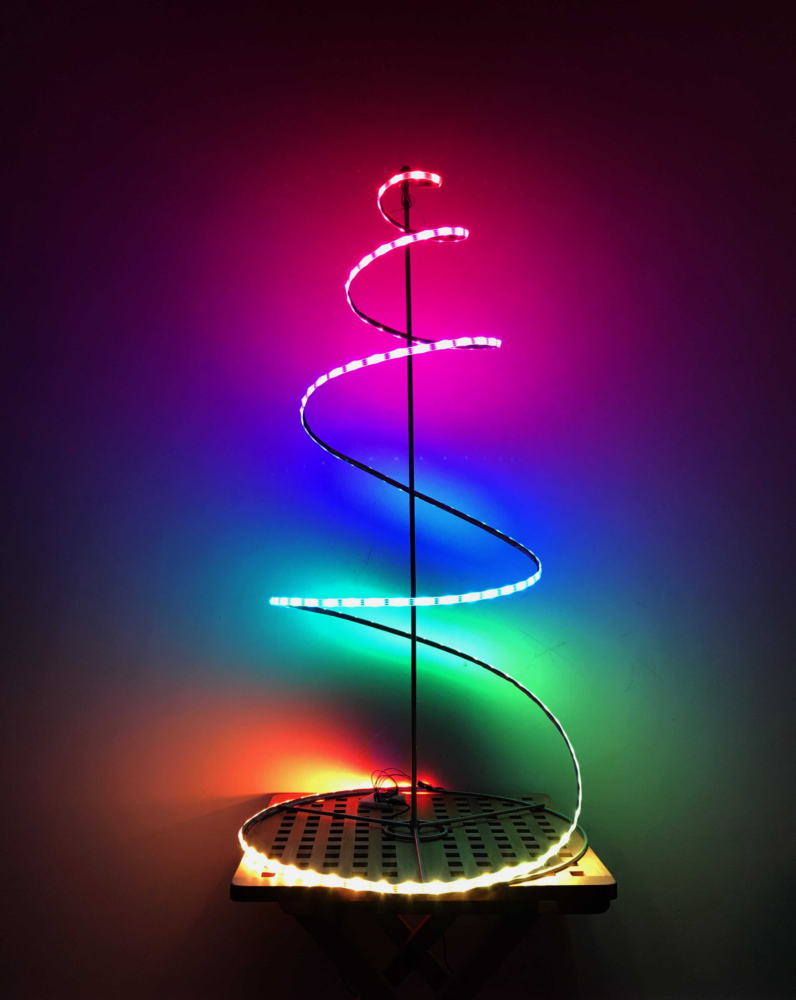
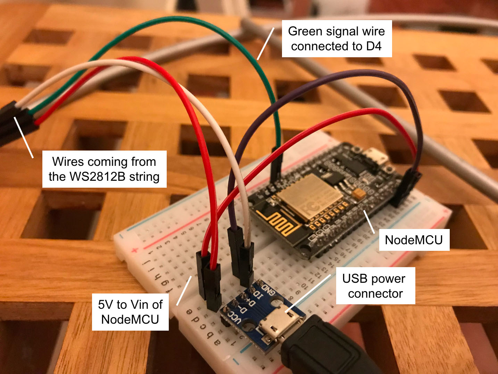

# Intelligent Christmas Tree  
**Christmas tree lights made out of WS2812B intelligent RGB leds and a NodeMCU**

## Introduction

So, no, it's not like this tree is going to do your Christmas shoppings anytime soon. But it does make for an interesting bright-colored ornament that will fit right into any room that needs intelligent lighting and bright-colored ornaments.

The frame of this Christmas tree comes from Ikea, a flat-packed metal thingy that extracts into a meter high spiral-shaped tree. Not that much to look at, but superb for mounting a string of WS2812B RGB leds. I'm sure likewise contraptions exist in all major shopping areas. I bought a reel with 5 meter WS2812B RGB leds from [BangGood](https://www.banggood.com/5M-45W-150SMD-WS2812B-LED-RGB-Colorful-Strip-Light-Waterproof-IP65-WhiteBlack-PCB-DC5V-p-1035640.html?rmmds=search&cur_warehouse=CN), of the type with 150 leds per 5 meter. There's also 300/5 meter available. As it happens, the metal spiral is exactly 5 meters long, so the string of leds fits really well.

I furthermore used a NodeMCU (you saw that comming) and a cheap 3 amps 5 volt USB adapter, plus a breadboard, some wire and an external USB chassis part. The string of WS2812B leds is powered from the adapter via the external USB chassis part. The NodeMCU is also connected to the adapter. A (one) data wire connects the NodeMCU with the first led.

## Hardware / wiring
 The string of WS2812B leds has three wires on both ends. One end is 'the input', the other end 'the output'. Strings of leds can be interconnected, outputs to inputs. The input has a socket (female) connector, the output has a pinned (male) connector. A string with 150 leds uses about 1,5 amps, much more than a NodeMCU can supply. Don't make the mistake of powering the leds through the USB connector of the NodeMCU: within a second a fume of smoke will signal the end of the NodeMCU (or more specific, the reverse-polarity-prevention-diode that only allows about 500 mA). So, programming, with the USB cable connected to the NodeMCU, is done **without** the leds connected. Testing is done with the USB cable connected to an external USB socket. The leds and the NodeMCU will now both be powered, but the large current for the string of leds does not flow through the NodeMCU.

## Software / lighting effects
(coming real soon. really.)

